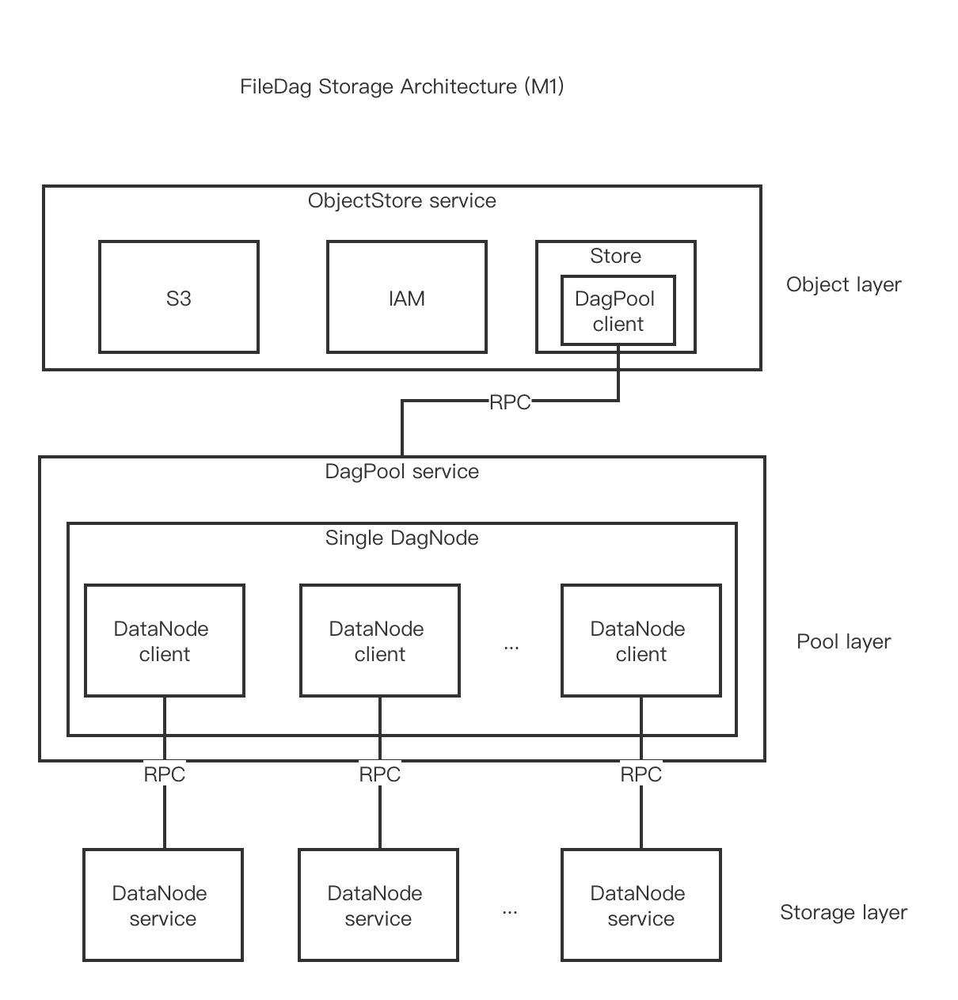

# Architecture

The overall architecture of FileDag Storage Milestone 1 is layered and consists of three parts: Storage Layer, Pool Layer, and Object Layer. Each layer of implementation is independent, flexible, and continuously evolving because they interact with each other only through the RPC protocol.

Let's take a look at the lowest layer Storage Layer, which mainly focuses on the Storage of data blocks and solves the problem of fast and efficient read and write. Currently, the key value Storage scheme is adopted.

The middle layer, Pool Layer, mainly manages the read/write and access permission control of DAG structured data. It manages DagNode cluster. Each DagNode manages several Datanodes and adopts Erasure Coding fragmentation technology. Each fragment is stored to the corresponding DataNode service through the DataNode Client. A single DagNode scheme has been implemented according to milestone 1. DagPool Client implements the blockstore interface and can be used anywhere blockstore is required.

Finally, the upper layer Object Layer implements the whole functions of Object storage, which is mainly divided into S3, IAM and Store. Therefore, FileDag Storage is compatible with S3 interfaces and has identity permission control.